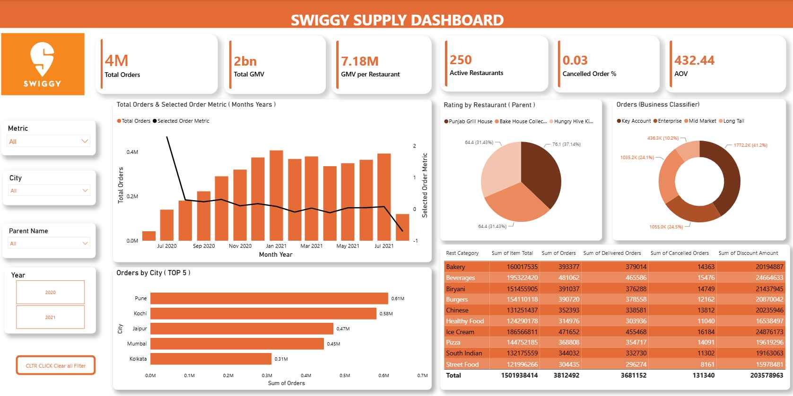

# Swiggy Supply & Restaurant Performance Analytics Dashboard

## 📌 Project Overview

An interactive Power BI dashboard developed to analyze restaurant and supply-side performance and provide insights into sales, customer ratings, delivery performance, and operational trends.

The project focuses on transforming business data into meaningful KPIs and interactive visualizations to support data-driven decision-making.

---

## 🎯 Business Objective

The objective of this project is to help business stakeholders:

- Monitor overall restaurant and sales performance
- Identify high-performing restaurants and locations
- Analyze customer ratings and feedback
- Evaluate delivery and operational performance
- Identify trends and areas requiring improvement
- Support data-driven business decisions

---

## 🛠️ Tools & Technologies

- **Power BI** – Dashboard development and visualization
- **DAX** – KPI calculations and analytical measures
- **Power Query** – Data cleaning and transformation
- **Excel / CSV** – Data source
- **Statistics** – Descriptive analysis and KPI interpretation

---

## 📊 Key Analysis Areas

### Restaurant Performance

Analyzed restaurant-level performance to identify high-performing and underperforming restaurants.

### Sales Analysis

Evaluated sales performance across different restaurants and business segments.

### Customer Ratings

Analyzed restaurant ratings to understand customer satisfaction and identify potential improvement areas.

### Delivery Performance

Evaluated delivery-related metrics to identify operational trends and potential service improvements.

### Location Analysis

Compared performance across different locations to identify important geographic patterns.

---

## 📊 Dashboard Preview

---

## 💡 Key Insights

- Identified variations in restaurant performance across locations.
- Analyzed customer ratings to understand overall restaurant experience.
- Evaluated sales trends and major performance contributors.
- Identified delivery and operational areas requiring further attention.
- Compared restaurant performance to support data-driven decision-making.

---

## 🛠️ Skills Demonstrated

- Data cleaning and transformation using Power Query
- Data modeling in Power BI
- DAX-based KPI development
- Restaurant and sales performance analysis
- Customer rating analysis
- Delivery performance analysis
- Geographic performance analysis
- Interactive dashboard development
- Business insights and recommendations

---

## 📌 Business Recommendations

- Focus on high-performing restaurants and locations to identify scalable growth opportunities.
- Investigate restaurants with low ratings to identify potential service or quality issues.
- Monitor delivery performance to improve customer experience.
- Analyze underperforming locations and identify operational improvement opportunities.
- Continuously monitor key KPIs to support data-driven decision-making.

---

## 📂 Project Files

| File | Description |
|---|---|
| `Dashboard/Swiggy_Dashboard.png` | Power BI dashboard preview |
| `README.md` | Project documentation and analysis |

> The Power BI `.pbix` source file is not included in this repository. It can be provided upon request.

---

## 👤 Author

**Subodh Salvi**

Aspiring Data Analyst

**Skills:** Power BI | SQL | Excel | Python | Tableau | Statistics
